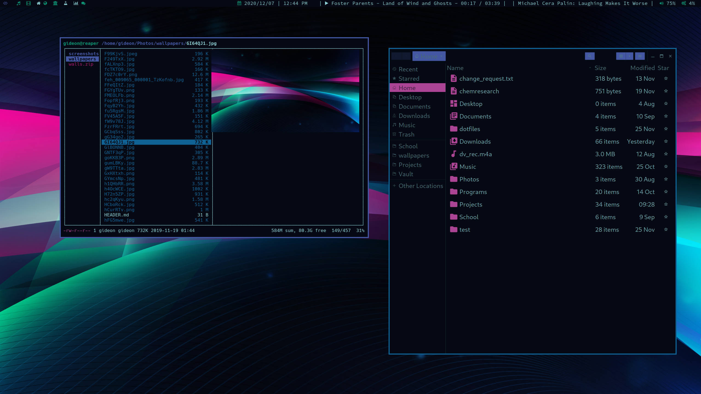

# Gallery

## System

🐟 Fish

  

  Custom `vi` mode indicators in the fish shell!

  

  Condensed `cwd` and `git` status in prompt

🦊 Firefox

  

  Pallete changed with [Pywalfox](https://github.com/Frewacom/pywalfox), startpage with [startTree](https://github.com/Paul-Houser/StartTree), custom `userChrome.css`

🦎 Chameleon

  

  Completely change theme with one script

🔔 dunst

  

  A few examples of `dunst` notifications

🔮 polybar

  `polybar` modules for each monitor.

  

  `dunst` and `picom` toggles

  

  Date and cpu usage

  

  Download, `picom` toggle, `KDE-Connect` module, system tray

💠 picom

  

  `picom` toggle located on polybar

🚀 rofi

  

  `rofi` with custom theme

✖️ xmenu

  

  `xmenu` for drop down application/script launching

## Communication

🌀 Discord

  

  Ummm... Completely stock Discord client... Nothing to see here Officer.

✉️ neomutt

  

  `neomutt` is looking good, might as well showcase some classic spam... 

💬 Weechat

  

## Development

🔥 neovim

  

  [vim.reaper](https://github.com/GideonWolfe/vim.reaper), my custom `neovim` configuration. See the page for many more screenshots

📜 LaTeX

  

  Autocompilation and preview in `zathura`

📉 gnuplot

  

  Using my `Gnuplot-Pywal` tool

📈 matplotlib

  

📝 Notes

  
  

  Math equations, UML diagrams, and much more.
  All accessible through `neovim`.

## Utility

📊 Monitors

  

  `bashtop` with custom theme, also showcasing `gotop` and `s-tui`.

🗓️ Calendar

  

🗓️  Habits

  

  Imagine what this would look like if I was good at tracking these...

🗒️  Scratchpad

  

  Various applications like `Qualculate` (left) and `translate-shell` (right) I use often enough to pin to the scrathpad and bind toggling to a keybind.

📜 PDFs

  

  `zathura` using my `Zathura-Pywal` tool

📁 Files

  

  `ranger` and `nautilus`

🔊 Volume

  

  Like most GTK+ apps, `pavucontrol` takes a great theme.

## Entertainment

📰 News

  

🎵 Spotify

  

  Spotify with `spicetify` theme

🎶 cmus

  

  `cmus` + `cava`, a classic combo

✨ Visualizers

  

  `cava` (top left) and various `glava` shaders.

🎁 Misc

  

  `asciiquarium`, `unimatrix`, `pipes.sh`

# Applications

## System

- [i3-gaps](https://github.com/Airblader/i3): Tiling window manager
- [polybar](https://github.com/polybar/polybar): Customizable taskbar
- [xmenu](https://github.com/phillbush/xmenu): Modular start menu
- [fish](https://fishshell.com/): Friedly Interactive SHell
- [rofi](https://github.com/davatorium/rofi): Application launcher
- [kdeconnect](https://community.kde.org/KDEConnect): Control system from phone
- [flameshot](https://github.com/lupoDharkael/flameshot): Robust screenshotting tool
- [giph](https://github.com/phisch/giph): Record gifs from your terminal
- [slop](https://github.com/naelstrof/slop): Screen region selector
- [xclip](https://github.com/astrand/xclip): Scriptable clipboard utility
- urxvt and [urxvt-resize-font-git](https://aur.archlinux.org/packages/urxvt-resize-font-git/)

## Tools

### Communication

- [neomutt](https://github.com/neomutt/neomutt): TUI email client
- [nctelegram](https://github.com/Nanoseb/ncTelegram): TUI Telegram client
- [Telegram desktop](https://aur.archlinux.org/packages/telegram-desktop-bin/)
- [weechat](https://github.com/weechat/weechat): Terminal IRC client
- [tuir](https://gitlab.com/ajak/tuir): Reddit in the terminal
- [kdeconnect-sms](https://community.kde.org/KDEConnect): Send SMS from your system
- [cordless](https://github.com/Bios-Marcel/cordless): TUI Discord client

### Development

- [Neovim](https://github.com/neovim/neovim): Amazing text editor
- [vim.reaper](https://github.com/GideonWolfe/vim.reaper): My custom neovim configuration
- [lazydocker](https://github.com/jesseduffield/lazydocker): TUI docker dashboard
- [Qalculate!](https://github.com/Qalculate): Intuitive and powerful calculator
- [gnuplot](http://www.gnuplot.info/): Graph and plot in the terminal
- [ghcal](https://github.com/IonicaBizau/ghcal): See the GitHub contributions calendar of a user in the command line.
- [hexyl](https://github.com/sharkdp/hexyl): Terminal hex viewer
- [bitwise](https://github.com/mellowcandle/bitwise): Terminal based bit manipulator in ncurses
- [gdb-dashboard](https://github.com/cyrus-and/gdb-dashboard): Modular visual interface for GDB in Python
- [github-stats](https://github.com/IonicaBizau/github-stats): Visualize stats about GitHub users and projects in your terminal.
- [QDbusViewer](https://www.archlinux.org/packages/extra/x86_64/qt5-tools/files/) Dbus investigator GUI
- [how2](https://github.com/santinic/how2): Search stack overflow from the terminal

### Education

- [Anki](https://apps.ankiweb.net/): Powerful, intelligent flash cards. 

### Productivity

- [dijo](https://github.com/NerdyPepper/dijo): Curses based habit tracker.
- [bibisco](https://bibisco.com/): Novel writing tool

### Science

- [Ugene](https://aur.archlinux.org/packages/ugene-git/): Bioinformatics suite [(meta-ugene-external_tools)](https://aur.archlinux.org/packages/meta-ugene-external_tools/)
- [pymol](https://pymol.org/2/): Molecular science suite
- [GROMACS](http://www.gromacs.org/Downloads): Molecular dynamics simulation suite
- [ASCIIGenome](https://github.com/dariober/ASCIIGenome) Text genome viewer
- [Alan](https://github.com/mpdunne/Alan) Text genome alignment viewer
- [alv](https://github.com/arvestad/alv) Text genome alignment viewer
- [Desmos-Destkop](https://github.com/DingShizhe/Desmos-Desktop): Electron desktop desmos app.
- [chemtool](https://www.archlinux.org/packages/extra/x86_64/chemtool/): A small program for drawing chemical structures
- [celestia](https://www.archlinux.org/packages/extra/x86_64/celestia/): Real-time space simulation
- [geogebra](https://www.archlinux.org/packages/community/x86_64/geogebra/): Dynamic mathematics software with interactive graphics, algebra and spreadsheet

### Personal
- [Khard](https://github.com/scheibler/khard): Console contact manager
- [Khal](https://github.com/pimutils/khal): Console calendar
- [Nextcloud client](https://www.archlinux.org/packages/community/x86_64/nextcloud-client/): Sync files with Nextcloud server
- [vdirsyncer](https://github.com/pimutils/vdirsyncer): Synchronize calendar and contacts with NextCloud

### Entertainment
#### Media
- [castero](https://aur.archlinux.org/packages/castero-git/): TUI for podcasts
- [newsboat](https://www.archlinux.org/packages/community/x86_64/newsboat/): TUI RSS reader
- [cava](https://github.com/karlstav/cava): Console music visualizer
- [glava](https://github.com/jarcode-foss/glava):  OpenGL audio spectrum visualizer 
- [cmus](https://github.com/cmus/cmus): Lightweight console music player
- [cmus-notify](https://github.com/dcx86r/cmus-notify): Notifications for `cmus`
- [youtube-dl](https://github.com/ytdl-org/youtube-dl/): Easily download music and videos
- [jftui](https://github.com/Aanok/jftui): Jellyfin TUI interface
- [swaglyrics](https://aur.archlinux.org/packages/swaglyrics/): Spotify lyrics in browser or terminal
#### Games
- [tetris-terminal](https://aur.archlinux.org/packages/tetris-terminal-git): Tetris in the terminal
- [tty-solitaire](https://aur.archlinux.org/packages/tty-solitaire-git/): Solitaire in the terminal
- [bs](https://aur.archlinux.org/packages/bs/): Battleship in the terminal
- [bsdgames](https://aur.archlinux.org/packages/nbsdgames-git/) : Collection of terminal games
- [dopewars](https://dopewars.sourceforge.io/): drug dealing game set in 1980s NYC
- [Cures of War](https://a-nikolaev.github.io/curseofwar/): Fast-paced action strategy game for Linux
#### Misc
- [pipes.sh](https://github.com/pipeseroni/pipes.sh): Animated pipes terminal screensaver
- [rain.sh](https://github.com/lbgists/rain.sh): Animated rain terminal screensaver
- [unimatrix](https://github.com/will8211/unimatrix): Matrix in your terminal
- [asciiquarium](https://github.com/cmatsuoka/asciiquarium): Aquarium in your terminal
- [bonsai.sh](https://gitlab.com/jallbrit/bonsai.sh): Grow a bonsai tree in your terminal
- [termtracker](https://github.com/trehn/termtrack): Track satellites in your terminal
- [Lyrebird](https://github.com/chxrlt/lyrebird): GTK Voice changer
- [genact](https://aur.archlinux.org/packages/genact/): Fake activity generator

### Utility

#### System
- [ckb-next](https://github.com/ckb-next/ckb-next): Corsair peripheral software
- [baobab](https://aur.archlinux.org/packages/baobab-git/): GUI disk usage analyzer
- [diskonaut](https://aur.archlinux.org/packages/diskonaut/): TUI disk usage analyzer
- [dust](https://github.com/bootandy/dust): TUI disk usage analyzer
- [zathura](https://wiki.archlinux.org/index.php/Zathura): Lightweight PDF reader
- [ranger](https://github.com/ranger/ranger): Vim inspired console file manager
- [haguichi](https://aur.archlinux.org/packages/haguichi-git/): GUI Hamachi client (requires [logmein-hamachi](https://aur.archlinux.org/packages/logmein-hamachi/))
- [dmenu-hotkeys](https://github.com/maledorak/dmenu-hotkeys): Searchable i3 keybinds for `rofi` or `dmenu`
- [gucharmap](https://www.archlinux.org/packages/extra/x86_64/gucharmap/): GNOME interface for system fonts
- [greenclip](https://github.com/erebe/greenclip): Clipboard manager
- gnome-font-viewer
- [glow](https://github.com/charmbracelet/glow): CLI/TUI markdown reader
- [rofi-emoji](https://github.com/Mange/rofi-emoji): An emoji selector plugin for Rofi
- [rofi-power-menu](https://github.com/jluttine/rofi-power-menu/blob/master/rofi-power-menu): Power menu for `rofi`
- [gpick](https://www.archlinux.org/packages/community/x86_64/gpick/): Advanced color picker
- [termdown](https://github.com/trehn/termdown): Countdown timer and stopwatch in your terminal 
- [peaclock](https://aur.archlinux.org/packages/peaclock/): Terminal timer and clock
- [yad](https://github.com/v1cont/yad): Create GTK interfaces from the command line

#### Monitors
##### System
- [s-tui](https://github.com/amanusk/s-tui): Terminal-based CPU stress and monitoring utility
- [CoreFreq](https://github.com/cyring/CoreFreq): Console CPU monitor
- [gotop](https://github.com/cjbassi/gotop): Terminal based graphical activity monitor
- [bashtop](https://github.com/aristocratos/bashtop/): Terminal based graphical activity monitor written in bash
- [glances](https://github.com/nicolargo/glances): Your system at a glance
- [iotop](https://www.archlinux.org/packages/community/any/iotop/): IO statistics
- [nmon](https://www.archlinux.org/packages/community/x86_64/nmon/): Configurable ncurses system monitor
- [atop](https://github.com/Atoptool/atop): System and process montior
- [powertop](https://www.archlinux.org/packages/community/x86_64/powertop/): Monitor system power
- [nvtop](https://www.archlinux.org/packages/community/x86_64/nvtop/): NVIDIA GPU TUI monitor
- [kmon](https://github.com/orhun/kmon): TUI Kernel monitor
- [lnav](https://github.com/tstack/lnav): Better log viewer
##### Network
- [dnstop](https://aur.archlinux.org/packages/dnstop): Terminal DNS monitor
- [ethstatus](https://aur.archlinux.org/packages/ethstatus/): Ethernet status monitor
- [jnettop](https://github.com/jwilk-mirrors/jnettop): view hosts/ports taking up the most network traffic
- [nload](https://www.archlinux.org/packages/community/x86_64/nload/): Monitors network traffic and bandwidth usage
- [bmon](https://github.com/tgraf/bmon): Bandwidth monitor
- [termshark](https://github.com/gcla/termshark/): Wireshark implemented in a TUI
- [gping](https://github.com/orf/gping): TUI ping with graph
- [speedtest-cli](https://www.archlinux.org/packages/community/any/speedtest-cli/): CLI speedtest program
##### Finance
- [cointop](https://github.com/miguelmota/cointop): TUI crypto market watcher
- [mop](https://aur.archlinux.org/packages/mop/): TUI stock market ticker
- [stonks](https://github.com/ericm/stonks): TUI Stock charts

#### Misc
- [synonym](https://github.com/smallwat3r/synonym): Thesaurus in the terminal
- [mapscii](https://github.com/rastapasta/mapscii): Map in your terminal
- [translate-shell](https://github.com/soimort/translate-shell): Google translate in the terminal
- [wtfuitil](https://github.com/wtfutil/wtf): Modular terminal dashboard
- [iponmap](https://github.com/nogizhopaboroda/iponmap): commandline IP location finder

### Security

- [Seahorse](https://security.archlinux.org/package/seahorse): GUI to manage PGP/SSH keys
- [keepassxc](https://www.archlinux.org/packages/community/x86_64/keepassxc/): Keepass GUI

## Theming

- [pywal](https://github.com/dylanaraps/pywal): Generate colorschemes from photos
- haishoku, colorthief, and colorz python modules for pywal backends
- [Chameleon](https://github.com/GideonWolfe/Chameleon): Automatically apply the schemes below
- [wal_steam](https://github.com/kotajacob/wal_steam): pywal colorscheme for steam
- [telegram-pallete-gen](https://github.com/matgua/telegram-palette-gen): pywal colorscheme for Telegram desktop
- [Zathura-Pywal](https://github.com/GideonWolfe/Zathura-Pywal): pywal colorscheme for zathura
- [Gnuplot-Pywal](https://github.com/GideonWolfe/Gnuplot-Pywal): pywal colorscheme for gnuplot
- [qutewal](https://github.com/jjzmajic/qutewal): pywal theme for qutebrowser
- [oomox](https://github.com/themix-project/oomox): Generate icon themes, spotify themes, and GTK themes from pywal
- [lxappearance](https://www.archlinux.org/packages/community/x86_64/lxappearance/): GUI for selecting/viewing GTK themes
- [Archdroid Icons](https://aur.archlinux.org/packages/archdroid-icon-theme-git/): For custom GTK themes
- [qt5ct](https://www.archlinux.org/packages/community/x86_64/qt5ct/): Qt5 configuration tool
- [qtcurve-qt5](https://www.archlinux.org/packages/community/x86_64/qtcurve-qt5/): Qt5/Qt4 config tool
- [qt5-styleplugins](https://www.archlinux.org/packages/community/x86_64/qt5-styleplugins/): Enable Qt features such as GTK theme
- [Pywalfox](https://github.com/Frewacom/Pywalfox): Thefe firefox and DDG with pywal
- [Plymouth](https://wiki.archlinux.org/index.php/plymouth): Boot splash animation
- [plymouth-themes](https://github.com/adi1090x/plymouth-themes): Collection of themes
